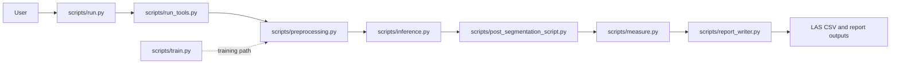
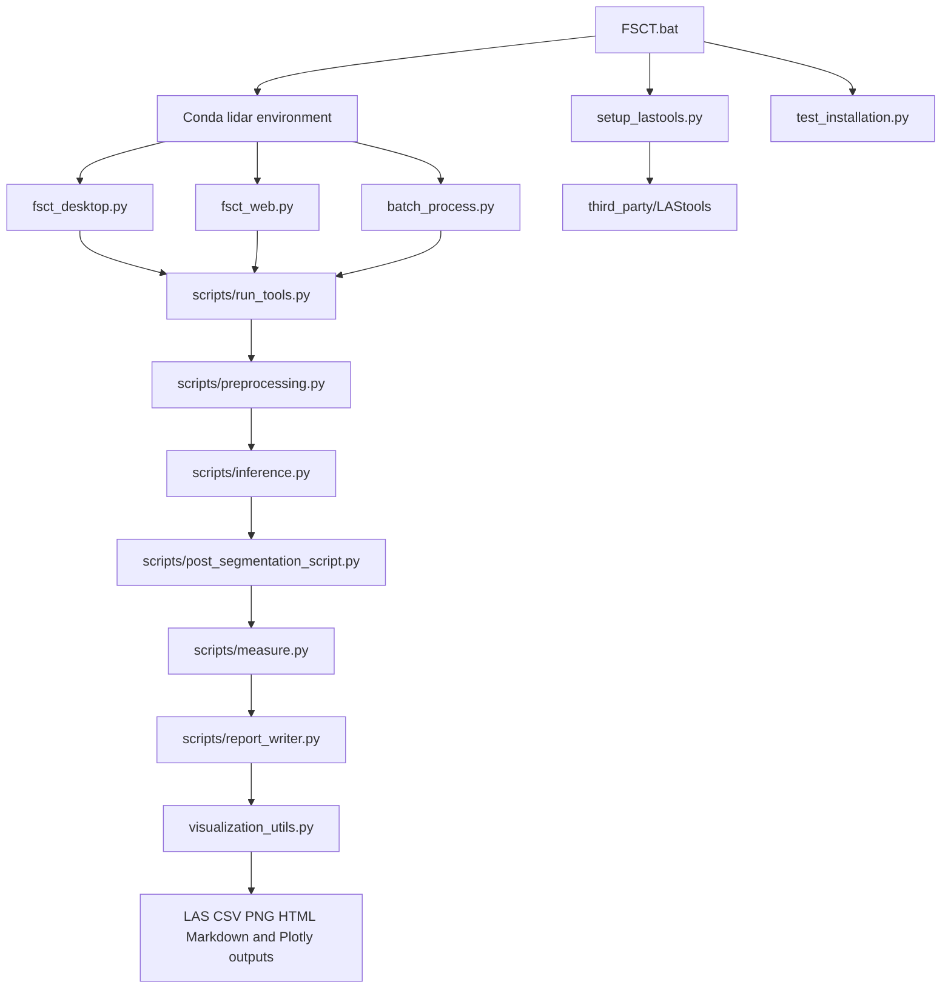
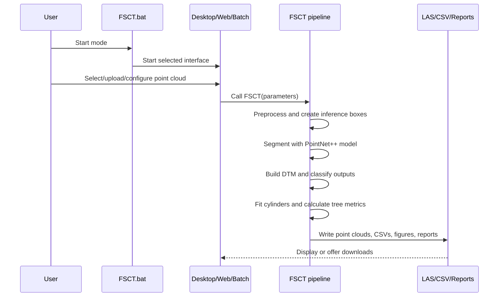
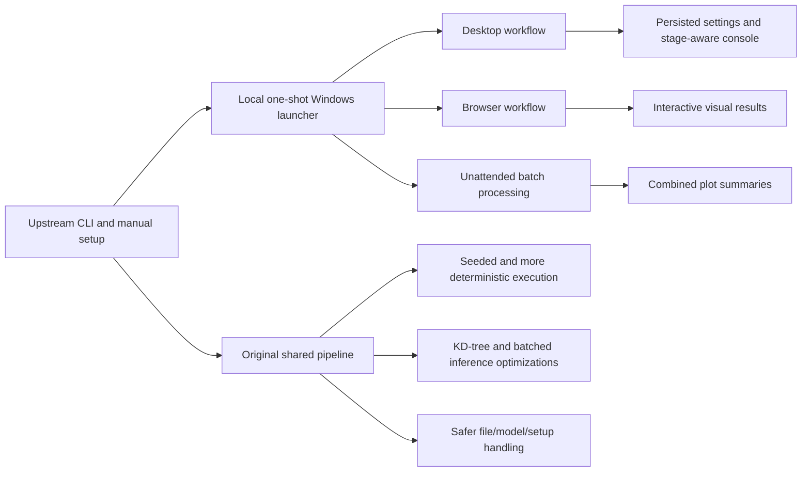

# FSCT Codebase Comparison

## Scope and Method

This report compares the working directory at the time of analysis with the
upstream repository [SKrisanski/FSCT](https://github.com/SKrisanski/FSCT),
using the upstream `main` branch as the reference. The local directory is not
a Git checkout, so a commit-to-commit diff and local history were unavailable.
The comparison therefore uses:

- the local source, configuration, documentation, fixtures, and generated
  outputs;
- the upstream repository tree and raw source files fetched on 2026-08-19;
- line counts and feature-level inspection of shared modules.

The local implementation is referred to as **Local FSCT** and the GitHub
repository as **Upstream FSCT**.

## Executive Summary

Local FSCT retains the upstream semantic-segmentation and forest-measurement
pipeline, but turns it into a packaged Windows-oriented application. The
largest additions are a CustomTkinter desktop UI, a Streamlit browser UI,
one-shot environment and LAStools setup, unattended directory processing,
visual analytics, installation checks, expanded documentation, and a larger
test fixture/output set.

The local version also changes shared processing code. The most important
engineering improvements are deterministic seeding, more efficient spatial
queries and inference transfers, safer model loading and archive extraction,
fresh LAS headers for generated files, and better handling of optional tools.
These improvements are operational rather than a new segmentation model: the
model asset and the core pipeline stages remain conceptually the same.

The main costs are increased configuration and dependency surface, duplicated
entry-point logic, mutable dictionary-based stage contracts, and a few known
correctness gaps in the browser results summary and cancellation behavior.

## Architecture at a Glance

### Upstream FSCT

Upstream is primarily a Python CLI/research tool. Its README directs users to
edit parameters in `run.py`, install `requirements.txt`, and select LAS files
through the script.

### Local FSCT

The local architecture adds several adapters around the same shared pipeline.
The desktop application is asynchronous at the UI boundary; the browser
application remains synchronous during inference.

## Repository Structure

| Area                | Upstream FSCT                      | Local FSCT                                                                                        | Difference and effect                                                                                       |
| ------------------- | ---------------------------------- | ------------------------------------------------------------------------------------------------- | ----------------------------------------------------------------------------------------------------------- |
| Primary entry point | `scripts/run.py`                 | `FSCT.bat`, `fsct_desktop.py`, `fsct_web.py`, `batch_process.py`, plus `scripts/run.py` | Local users can choose GUI, browser, CLI, or unattended batch workflows.                                    |
| Core processing     | `scripts/`                       | `scripts/`                                                                                      | The same conceptual stages remain: preprocessing, inference, post-segmentation, measurement, and reporting. |
| Desktop UI          | None                               | `fsct_desktop.py`                                                                               | Adds a five-page CustomTkinter workflow for point-cloud operations, tools, analysis, results, and settings. |
| Browser UI          | None                               | `fsct_web.py`                                                                                   | Adds upload, processing controls, downloads, tables, previews, and Plotly results.                          |
| Batch workflow      | Basic CSV combiner                 | `batch_process.py`, `wrapper_config.json`                                                     | Adds recursive directory processing, per-file isolation, configuration, and combined summaries.             |
| Installation        | Manual environment setup in README | `FSCT.bat`, `setup_lastools.py`, `gui_config.json`, `.fsct_setup`                         | Adds guided Windows setup, PyTorch selection, LAStools setup, and persisted GUI settings.                   |
| Visualization       | Report figures                     | `visualization_utils.py` plus generated PNG figures                                             | Adds reusable tree maps, distributions, scatter plots, 3D views, and summary metrics.                       |
| Verification        | No installation test file          | `test_installation.py`                                                                          | Checks Python, PyTorch, PyG operators, scientific imports, required assets, CUDA state, and optional tools. |
| Test/example assets | Small source datasets and model    | Additional LAS inputs and a complete example output directory                                     | Provides a practical regression fixture, although no automated end-to-end test consumes it.                 |
| Third-party tools   | No bundled LAStools tree           | `third_party/LAStools/`                                                                         | Makes the external viewer/conversion workflow available locally, with a larger distribution footprint.      |

## File-Level Comparison

The following counts are from the current local files and the corresponding
upstream `main` files. They indicate scope, not code quality or executable
behavior.

| Shared file                                 | Local lines | Upstream lines | Local delta | Interpretation                                                                       |
| ------------------------------------------- | ----------: | -------------: | ----------: | ------------------------------------------------------------------------------------ |
| `README.md`                               |         500 |            378 |        +122 | Documents the application, reproducibility, performance, and new workflows.          |
| `requirements.txt`                        |          95 |             54 |         +41 | Adds desktop, web, visualization, and operational dependencies.                      |
| `scripts/run_tools.py`                    |          77 |             77 |           0 | Same size, but local behavior includes changes in the surrounding pipeline contract. |
| `scripts/preprocessing.py`                |         273 |            243 |         +30 | Adds processing controls and efficiency/reproducibility changes.                     |
| `scripts/inference.py`                    |         241 |            160 |         +81 | Expands inference handling, including batching and deterministic execution.          |
| `scripts/post_segmentation_script.py`     |         235 |            242 |          -7 | Similar stage scope with implementation changes rather than growth.                  |
| `scripts/measure.py`                      |       2,180 |          1,609 |        +571 | Largest shared-module expansion; includes measurement and fitting improvements.      |
| `scripts/report_writer.py`                |         433 |            417 |         +16 | Extends reporting and generated figures.                                             |
| `scripts/tools.py`                        |         384 |            295 |         +89 | Adds file, point-cloud, and utility handling.                                        |
| `scripts/other_parameters.py`             |          58 |             33 |         +25 | Adds exposed runtime and reproducibility controls.                                   |
| `scripts/run.py`                          |          65 |             65 |           0 | CLI entry-point surface remains substantially compatible.                            |
| `scripts/combine_multiple_output_CSVs.py` |          62 |             62 |           0 | Existing aggregation utility remains compatible in size and role.                    |

## Local Additions

| Local path                                          | Purpose                                                                                                           | User impact                                                                                         |
| --------------------------------------------------- | ----------------------------------------------------------------------------------------------------------------- | --------------------------------------------------------------------------------------------------- |
| [`FSCT.bat`](FSCT.bat)                             | Creates/reuses the Conda environment, chooses the PyTorch stack, and dispatches GUI/web/verification/setup modes. | Reduces setup friction on Windows and provides named launch commands.                               |
| [`fsct_desktop.py`](fsct_desktop.py)               | CustomTkinter desktop application.                                                                                | Makes file selection, parameters, processing, results, and tools accessible without editing Python. |
| [`fsct_web.py`](fsct_web.py)                       | Streamlit application.                                                                                            | Enables browser-based operation and downloadable visual results.                                    |
| [`batch_process.py`](batch_process.py)             | Sequential directory processor and summary combiner.                                                              | Supports unattended multi-plot workflows.                                                           |
| [`visualization_utils.py`](visualization_utils.py) | Reusable Plotly visualization builders.                                                                           | Adds interactive maps, distributions, scatter plots, 3D clouds, and metric displays.                |
| [`setup_lastools.py`](setup_lastools.py)           | Downloads, extracts, validates, and configures LAStools.                                                          | Makes optional LAS conversion/viewing tools discoverable from the app.                              |
| [`test_installation.py`](test_installation.py)     | Environment and asset validation.                                                                                 | Detects installation failures before a long processing run.                                         |
| [`gui_config.json`](gui_config.json)               | Desktop appearance and LAStools persistence.                                                                      | Preserves GUI settings between launches.                                                            |
| [`wrapper_config.json`](wrapper_config.json)       | Batch defaults and wrapper settings.                                                                              | Separates some batch configuration from the processing code.                                        |
| [`USAGE.md`](USAGE.md)                             | Detailed setup, workflows, troubleshooting, and parameter guidance.                                               | Provides a practical operational manual absent from the upstream package.                           |

## Shared-Pipeline Improvements

| Area                      | Upstream limitation or approach                                                       | Local improvement                                                                                                 | Benefit                                                           | Qualification                                                                           |
| ------------------------- | ------------------------------------------------------------------------------------- | ----------------------------------------------------------------------------------------------------------------- | ----------------------------------------------------------------- | --------------------------------------------------------------------------------------- |
| Reproducibility           | Preprocessing shuffling and RANSAC fitting were not fully controlled by one run seed. | `random_seed` controls sampling and per-stem fitting; box/stem seeds are derived independently of thread order. | Repeated runs can be compared and debugged more reliably.         | Exact equality depends on seed, batch size, and whether mixed precision is enabled.     |
| Spatial lookup            | Repeated broad point-cloud scans were used in relevant preprocessing paths.           | KD-tree queries reduce repeated full-cloud search work.                                                           | Better scaling for larger clouds.                                 | The underlying algorithm and output semantics are unchanged.                            |
| Inference transfer        | Point labels could require large or repeated GPU-to-host transfer work.               | Transfers are batched and verified against the full output.                                                       | Lower peak transfer pressure and improved throughput.             | Memory and runtime still depend strongly on batch size and hardware.                    |
| Mixed precision           | No explicit local mixed-precision workflow was documented upstream.                   | Optional AMP support reduces GPU memory use and can improve speed.                                                | Makes larger workloads more practical on supported GPUs.          | AMP is close to, but not guaranteed to be bit-identical with, fp32.                     |
| Model loading             | Older loading behavior was used upstream.                                             | Uses safer`weights_only=True` loading where supported.                                                          | Reduces deserialization exposure and makes intent explicit.       | Compatibility depends on the model/checkpoint format.                                   |
| LAS writing               | Generated/resampled files could inherit unsuitable headers.                           | Fresh LAS headers are used for resampling and clean-copy repair.                                                  | Improves validity and interoperability of generated point clouds. | Extension handling still has a documented case-sensitivity edge case in`save_file()`. |
| Windows numerical runtime | Upstream installation was manual.                                                     | Setup documents/enforces the OpenBLAS workaround for a Windows MKL failure mode.                                  | Fewer environment-specific numerical crashes.                     | It increases setup branching and platform-specific behavior.                            |
| Archive extraction        | No local setup helper existed upstream.                                               | LAStools extraction includes path-traversal protection.                                                           | Safer handling of downloaded ZIP contents.                        | Download integrity is not independently verified with a checksum/signature.             |
| UI responsiveness         | CLI was the normal interaction model.                                                 | Desktop processing uses worker threads and a queue-driven Tk event loop.                                          | Long jobs do not block the desktop window.                        | The running FSCT job is still not cancellable.                                          |
| Optional dependencies     | Core installation was the main documented path.                                       | Visualization and LAStools features degrade gracefully when optional components are unavailable.                  | More flexible installations and clearer fallback behavior.        | The dependency file is larger and has more version-interaction risk.                    |

## User-Workflow Improvements

| Workflow                    | Upstream                                            | Local                                                                                         | Assessment                                                                                   |
| --------------------------- | --------------------------------------------------- | --------------------------------------------------------------------------------------------- | -------------------------------------------------------------------------------------------- |
| Select input plots          | Edit/run`scripts/run.py` and use its file dialog. | Desktop file picker, browser upload, CLI, or batch directory input.                           | Major accessibility improvement.                                                             |
| Configure parameters        | Edit Python dictionaries.                           | UI controls expose common parameters; advanced values remain in Python.                       | Better for routine use, but configuration is now split across UI defaults, JSON, and Python. |
| Monitor processing          | Console output.                                     | Desktop console/progress/stage display; browser progress is limited.                          | Desktop is materially better; web progress is currently only partly real.                    |
| Inspect inputs              | External point-cloud software or the pipeline.      | Header inspection, previews, conversion, resampling, repair, and LAStools viewer integration. | Strong operational improvement.                                                              |
| Inspect outputs             | Open generated files/reports manually.              | Results page, CSV tables, downloads, figures, and Plotly views.                               | Strong discovery and presentation improvement.                                               |
| Process many plots          | Select multiple files or combine existing CSVs.     | Recursive sequential directory processing with timestamped combined output.                   | Better unattended operation.                                                                 |
| Recover from setup failures | Diagnose package installation manually.             | `FSCT.bat verify` and `test_installation.py`.                                             | Faster diagnosis, though it is validation rather than full automated repair.                 |

## Figures: Processing and Control Flow

## Figures: Improvement Timeline

## Regressions, Gaps, and Tradeoffs

These items are important because the local code is broader, but not every
change is an unconditional improvement.

| Finding                            | Evidence in local code                                                                                                                                                                                                                                                             | Impact                                                                                            | Recommended follow-up                                                                |
| ---------------------------------- | ---------------------------------------------------------------------------------------------------------------------------------------------------------------------------------------------------------------------------------------------------------------------------------- | ------------------------------------------------------------------------------------------------- | ------------------------------------------------------------------------------------ |
| Browser summary schema mismatch    | [`fsct_web.py`](fsct_web.py) checks legacy names such as `Number of Trees` and `Mean Tree Height`, while the pipeline writes names such as `Num Trees in Plot` and `Mean Height`; [`visualization_utils.py`](visualization_utils.py) already contains the newer mapping. | Some summary metrics may render blank even when`plot_summary.csv` is valid.                     | Centralize the schema mapping and use it in both web and desktop results.            |
| Desktop stop is not cancellation   | [`fsct_desktop.py`](fsct_desktop.py) documents/implements a stop action that cannot interrupt an active FSCT job.                                                                                                                                                                 | Users may wait for a long job or close the app with partial outputs.                              | Add cooperative cancellation checks between pipeline stages and inside long loops.   |
| Web inference is synchronous       | [`fsct_web.py`](fsct_web.py) runs inference in the Streamlit request.                                                                                                                                                                                                             | The browser cannot reliably cancel or monitor stages, and progress is not a true pipeline signal. | Move execution to a managed worker/job model with status and cleanup.                |
| Memory-heavy web file handling     | Upload inspection and result downloads buffer complete files.                                                                                                                                                                                                                      | Large point clouds can increase process memory substantially.                                     | Stream or stage files on disk and bound download buffering.                          |
| Fragmented configuration           | Common defaults are duplicated in the two UIs; batch defaults are in`wrapper_config.json`; advanced defaults are in `scripts/other_parameters.py`.                                                                                                                             | Settings can drift and behavior is harder to reproduce from one source.                           | Define one typed parameter schema and generate UI controls from it.                  |
| Mutable stage contract             | Pipeline stages communicate through shared parameter dictionaries and generated files.                                                                                                                                                                                             | Partial reruns, validation, and concurrent jobs are harder to reason about.                       | Introduce typed stage inputs/outputs or immutable run context objects incrementally. |
| Sparse-cloud failure risk remains  | The local documentation retains the upstream limitation that no-tree and sparse cases can fail during later processing.                                                                                                                                                            | A valid input can still end in a runtime error rather than a structured empty result.             | Add explicit empty/sparse checks and regression fixtures.                            |
| No automated behavioral test suite | [`test_installation.py`](test_installation.py) validates environment readiness but does not test pipeline outputs, UI behavior, or schema compatibility.                                                                                                                          | Improvements can regress silently.                                                                | Add a small deterministic end-to-end test using`data/test` and schema assertions.  |

## Overall Assessment

| Dimension             | Verdict                                                                                                                    |
| --------------------- | -------------------------------------------------------------------------------------------------------------------------- |
| Processing capability | Preserved and extended; the core FSCT measurement purpose remains intact.                                                  |
| Ease of installation  | Substantially improved for Windows users through`FSCT.bat` and verification.                                             |
| Ease of use           | Substantially improved through desktop, browser, and batch entry points.                                                   |
| Observability         | Improved on desktop and in generated visual outputs.                                                                       |
| Reproducibility       | Improved materially through explicit seeding and deterministic seed derivation, with AMP/batch-size caveats.               |
| Performance           | Improved in selected preprocessing, inference, and measurement paths; no claim is made here that every workload is faster. |
| Maintainability       | Mixed: more modular user-facing helpers, but more dependencies, duplicated configuration, and mutable cross-stage state.   |
| Test confidence       | Improved installation diagnostics, but still weak behavioral regression coverage.                                          |

## Sources

- Upstream repository: [github.com/SKrisanski/FSCT](https://github.com/SKrisanski/FSCT)
- Upstream README: [raw README](https://raw.githubusercontent.com/SKrisanski/FSCT/main/README.md)
- Local operating guide: [`USAGE.md`](USAGE.md)
- Local project overview: [`README.md`](README.md)
- Local core orchestrator: [`scripts/run_tools.py`](scripts/run_tools.py)
- Local desktop interface: [`fsct_desktop.py`](fsct_desktop.py)
- Local browser interface: [`fsct_web.py`](fsct_web.py)
- Local batch interface: [`batch_process.py`](batch_process.py)
