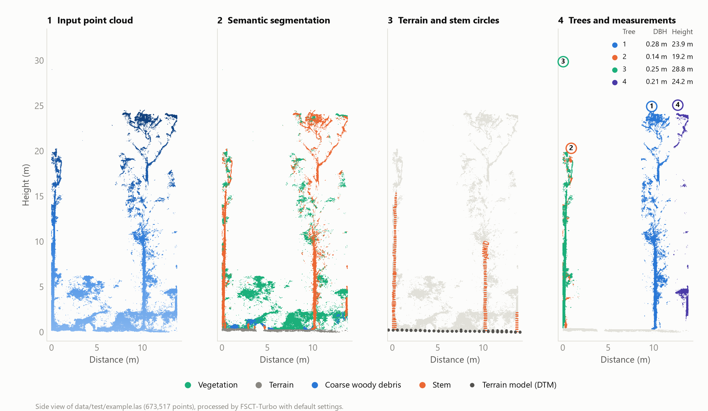
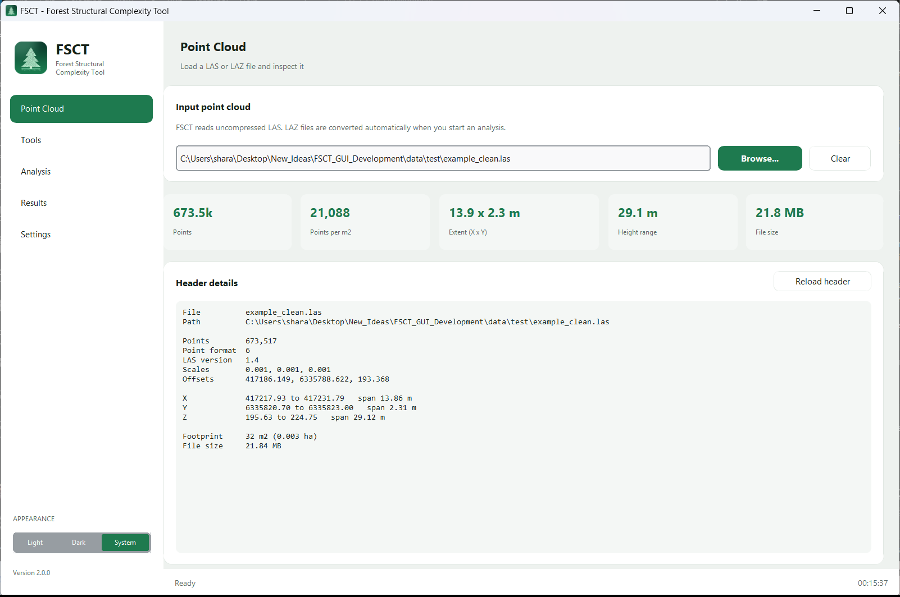
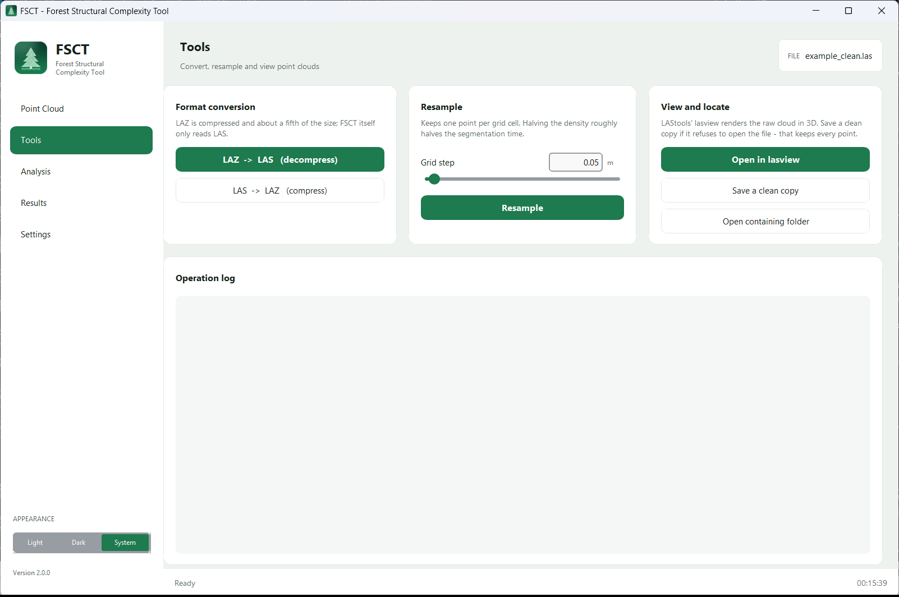
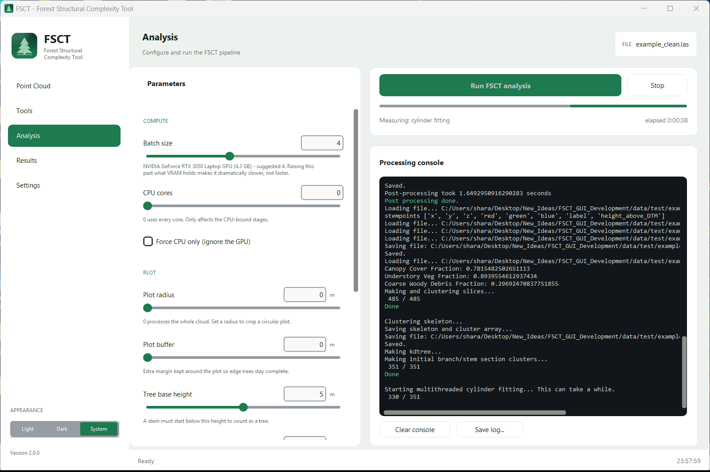
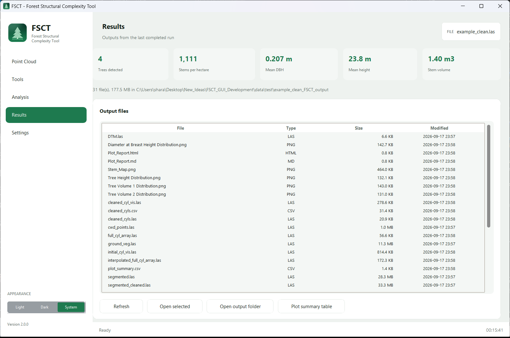
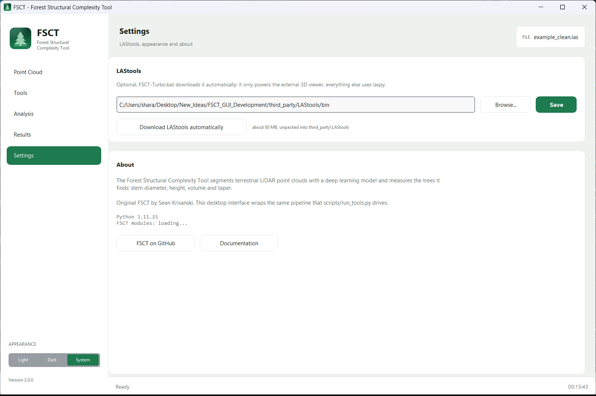
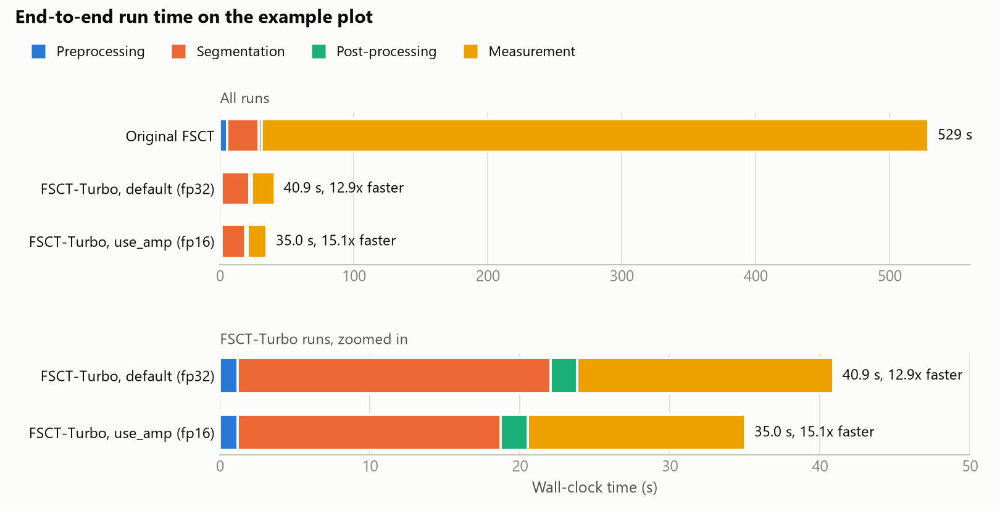
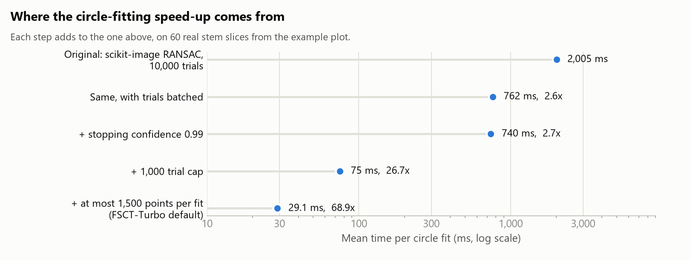

# FSCT-Turbo

A faster, reproducible build of the **Forest Structural Complexity Tool
(FSCT)**, with a desktop application and a one-click Windows installer.

> **FSCT-Turbo is built on [FSCT](https://github.com/SKrisanski/FSCT) by Sean
> Krisanski and colleagues** (University of Tasmania). The segmentation model,
> its trained weights, the measurement method and the example data are their
> work; see [Credits](#credits-and-acknowledgements).
>
> This README covers only what FSCT-Turbo adds. For what FSCT is, what it
> measures and which sensors it suits, read the original README:
> [purpose](https://github.com/SKrisanski/FSCT#purpose-of-this-tool),
> [output files](https://github.com/SKrisanski/FSCT#fsct-outputs),
> [parameters](https://github.com/SKrisanski/FSCT#user-parameters),
> [known limitations](https://github.com/SKrisanski/FSCT#known-limitations) and
> [training a new model](https://github.com/SKrisanski/FSCT#instructions-for-training-a-new-semantic-segmentation-model).

*The bundled example plot, `data/test/example.las`, after one FSCT-Turbo run
with default settings, seen from the side: the input cloud, its semantic
segmentation, the terrain model with the fitted stem circles, and the points
assigned to each tree with its measured DBH and height.*

**Version 1.0.0.** Version numbers count the original FSCT as version 0.

**Install and run:** install [Miniforge](https://github.com/conda-forge/miniforge/releases/latest),
then double-click `FSCT-Turbo.bat`. The full guide is [USAGE.md](USAGE.md);
release history is in [CHANGELOG.md](CHANGELOG.md).

## At a glance

|                          | Original FSCT (version 0)                                    | FSCT-Turbo 1.0                                                     |
| ------------------------ | ------------------------------------------------------------ | ------------------------------------------------------------------ |
| How you run it           | Edit parameters at the top of `scripts/run.py`, execute it   | Desktop app, command line or unattended batch                      |
| Installation             | Assemble the conda environment yourself                      | `FSCT-Turbo.bat` does it, asking nothing                           |
| Example plot, end to end | 529 s                                                        | 40.9 s, **12.9x faster** (9.6x on a quieter machine)               |
| Measurement stage        | 498 s                                                        | 17.1 s, **29x faster** (22x on a quieter machine)                  |
| One circle fit           | 2,039 ms                                                     | 29.4 ms, **69x faster**                                            |
| Repeat runs on one file  | 7 to 9% of point labels differ                               | Bit-identical, at any core count and batch size                    |
| CPU-only machines        | Worse segmentation than on a GPU; seed has no effect         | The network sees the same neighbourhoods as on a GPU               |
| Large clouds             | 5.1 million points: `MemoryError` on a 16 GB machine         | Completes in 156 s                                                 |
| `Volume_1`               | Wrong frustum formula, radii halved twice                    | Corrected                                                          |

## Desktop application

Upstream has no interface: you edit `scripts/run.py` and run it. FSCT-Turbo
adds a desktop application, `fsct_desktop.py`, which `FSCT-Turbo.bat` launches
(also `FSCT-Turbo.bat gui`). Five pages, selected from the sidebar; the file
you are working on stays in the header on every page.

**Point Cloud.** Pick a LAS or LAZ file. Only the header is read, so even a
multi-gigabyte file shows its point count, density, extent, height range and
coordinate offsets instantly.

**Tools.** LAZ/LAS conversion, resampling to a grid step, LAStools' 3D viewer,
and a clean-copy repair for files whose headers other software rejects.

**Analysis.** Every parameter with a slider, a typed field and a one-line
explanation. The batch size defaults to what the detected GPU can hold, and the
page says why. The console shows the pipeline's own output live, with the
current stage and elapsed time above it.

**Results.** Trees detected, stems per hectare, mean DBH, mean height and stem
volume from `plot_summary.csv`, above a browser of every output file. Files
open in their associated application, LAS files in lasview, and the plot
summary as a table.

**Settings.** The LAStools path, a one-click LAStools download, light and dark
appearance, and the Python, PyTorch and CUDA versions in use.

## Installation and tooling

- **One-shot installation.** `FSCT-Turbo.bat` builds the conda environment,
  installs a matching PyTorch, PyTorch Geometric and torch-cluster set, installs
  the desktop app and downloads LAStools, without asking anything, then starts
  the app. Subcommands: `gui`, `setup`, `setup /force`, `verify`, `lastools`,
  `version`, `help`.
- **Unattended batch processing** (`batch_process.py`): process a directory
  tree from the command line and combine the per-plot summaries into one CSV.
  Upstream's directory mode opens a folder dialog and cannot be scripted.
- **LAStools integration** (`setup_lastools.py`): downloaded and configured
  automatically, with LAS/LAZ conversion, resampling and an external 3D viewer
  in the desktop app.
- **Installation self-test** (`test_installation.py`, `FSCT-Turbo.bat verify`):
  checks Python, the deep-learning stack, the linear-algebra routines, the
  point-cloud and reporting libraries, the core files, the FSCT imports, and
  the optional GPU, LAStools and UI components.
- **One version number** (`version.py`), shown in the desktop app, the
  installation test, `FSCT-Turbo.bat version` and `batch_process.py --version`.

## Performance

Measured on `data/test/example.las` (673,517 points, four trees) on a laptop
with a Ryzen 7 7735HS, 16 GB RAM and an RTX 3050 Laptop GPU (4 GB). Original
FSCT is [SKrisanski/FSCT](https://github.com/SKrisanski/FSCT) at `68e2f1e`,
with library-compatibility edits only. Both ran with upstream's default
parameters, batch size 2 and 8 workers. Runs were interleaved (original, Turbo
fp32, Turbo fp16) and the sequence repeated twice, so each ratio compares runs
made minutes apart. Measured on FSCT-Turbo 1.0.0:

| Stage           | Original FSCT | FSCT-Turbo, default (fp32) | FSCT-Turbo, `use_amp=True` (fp16) |
| --------------- | ------------: | -------------------------: | --------------------------------: |
| Preprocessing   |        5.43 s |              1.16 s (4.7x) |                     1.17 s (4.6x) |
| Segmentation    |       23.40 s |            20.87 s (1.12x) |                   17.55 s (1.33x) |
| Post-processing |        2.21 s |             1.78 s (1.24x) |                    1.79 s (1.23x) |
| Measurement     |      498.12 s |            17.09 s (29.1x) |                   14.51 s (34.3x) |
| **Total**       |  **529.16 s** |        **40.90 s (12.9x)** |               **35.02 s (15.1x)** |

The ratios move with background load, not just the absolute times. The machine
was busy during these rounds, and the original's measurement stage, made of
Python-level loops, slows down more under load than FSCT-Turbo's. An earlier
interleaved session on a quieter machine, with a development build of the same
measurement code, measured 330 s against 34.4 s: **9.6x**, which is the
conservative figure to quote.

fp16 is faster but not bit-exact, so it is off by default; see
[Reproducibility](#reproducibility).

The network and its weights are unchanged. Most of the changes are exact
reformulations, giving the same output for the same random draws at a lower
asymptotic cost:

- **Circle fitting** dominated the original run. RANSAC trials are now formed,
  solved and scored as arrays instead of one Python loop iteration each, with
  the same model and scoring. On its own this is 2.6x; the trial cap and point
  cap below give the rest.
- **Box extraction** used a boolean scan of the whole cloud per box. It is now
  one shared k-d tree with a Chebyshev-ball query, which is exactly an
  axis-aligned cube, and the GIL is released so the worker threads run in
  parallel. The tree returns indices in its own traversal order, so they are
  sorted before the gather and each box holds the same points in the same
  order as the original scan. The order matters: the network keeps the first
  64 neighbours by index, and a development build that gathered unsorted
  labelled about 9% more of the example plot as stem than the original, well
  outside the original's own run-to-run spread.
- **Segmentation output** is moved off the GPU once per batch instead of seven
  blocking copies, four of them in a per-sample loop. Mixed precision (fp16) is
  available with `use_amp=True`.
- **Label transfer** back to the full cloud works in blocks of 250,000 points on
  four columns instead of one (N, 16, 7) temporary, so memory no longer grows
  with the plot.
- **Cylinder sorting, cleaning and volume summation** rebuilt a spatial index
  and copied the array for every cylinder. One index plus an active mask gives
  the same order and the same neighbourhoods.
- **Slice and plane cutting** sort once and binary-search instead of scanning
  per slice or per skeleton position. **Slice clustering** runs in parallel.
- **The DTM** is built with four threaded counting queries instead of a Python
  loop grown with `np.vstack`, and triangulated once instead of three times per
  tree.
- **One worker pool**, started during GPU segmentation when memory allows,
  replaces four pools spawned on demand. Each spawn re-imported numpy, scipy,
  sklearn and hdbscan in every worker on Windows.

Two changes trade exactness for speed and are reported separately. The RANSAC
trial cap was lowered from 10,000 to 1,000, and slices with more than 1,500
points are subsampled for fitting (CCI still uses every point). Together they
give most of the circle-fitting speed-up:

They move the fitted radius by a median of 0.7 mm, against 0.1 mm between two
runs of the original fit with different seeds. Set `circle_fit_trials=10000`
and `circle_fit_max_points=0` to get the original behaviour back.

### Batch size: bigger is not faster

Segmentation memory scales with the batch, and spilling out of VRAM costs far
more than a small batch. In fp32 on a 4 GB card:

| batch | time   | peak VRAM |
| ----- | ------ | --------- |
| 2     | 17.0 s | 1.37 GB   |
| 4     | 25.3 s | 2.42 GB   |
| 6     | 54.2 s | 3.28 GB   |

Mixed precision roughly halves the memory needed. The desktop app picks the
default batch size from the detected VRAM and says so under the slider.

### Large clouds

The 5.1-million-point plot that ran out of memory on a 16 GB machine with the
original code completes end to end in 156 s on a quiet machine.

## Reproducibility

FSCT-Turbo gives the same answer every time. A run is bit-identical to any
other run of the same file with the same `random_seed`, whatever the CPU core
count, the batch size, the order the filesystem lists files in, or whether it is
the first or tenth plot in a batch.

In the original code, repeat runs on the same file disagreed on 7 to 9% of
point labels, and a CPU-only machine segmented worse than a GPU. The causes,
and what replaced each:

| Original behaviour | FSCT-Turbo |
| --- | --- |
| Boxes over `max_points_per_box` subsampled with an unseeded shuffle | Seeded by the box's id |
| Farthest-point sampling started at a random point, drawn from a different generator on CPU and GPU, from one stream shared across the batch | Start seeded by the box's id, identical on both devices |
| On CPU, the network's 64-neighbour limit kept neighbours in k-d tree order; on the GPU, in index order, which is what the model was trained on | Index order on both |
| Box files read in filesystem order, which decided batching and the order of the assembled cloud | Read in box-id order |
| Feature interpolation summed with GPU atomics, in whatever order they land | Summed in a fixed order |
| RANSAC circle fits unseeded | Seeded by the stem cluster |
| Worker results collected in completion order | Collected in task order |

Set `random_seed=None` for the original non-reproducible behaviour.

On the example plot, runs at batch size 1, 2 and 4, on 8 and 16 cores, in
one process or a fresh one, all give the same 673,517 labels; a CPU run differs
from a GPU run on 84 of them and measures the same four trees, with identical
DBH and height. Repeat runs of the original differ on 50,000 to 63,000.
FSCT-Turbo under different seeds differs from the original by the same amount
as the original differs from itself (mean 9.2% against 9.1% over three runs
each). [CHANGELOG.md](CHANGELOG.md) has the details.

One option trades exactness for speed: `use_amp=True` runs segmentation in
fp16, about 15% faster on that stage, but fp16 reductions are not
bit-reproducible (2 of 673,517 labels differed between identical runs) and
0.15% of labels (994) differ from fp32. It is off by default.

What stays approximate is arithmetic across hardware: a CPU and a GPU, or two
GPU generations, round floating-point sums differently, which can flip a
point whose top two class scores are within rounding of each other. The
neighbourhoods, samples and seeds are identical everywhere.

## Correctness and compatibility fixes

Fixed relative to the original code; each is described in full in
[CHANGELOG.md](CHANGELOG.md):

- **Runs on current libraries.** `np.percentile(..., interpolation=)` was
  removed in numpy 2.0 and crashed the measurement stage just before tree
  heights. `pandas.read_csv(delim_whitespace=)` was removed in pandas 3.0.
  `DataLoader` moved out of `torch_geometric.data` in PyG 2.0.
- **`Volume_1` was wrong twice over.** The frustum formula added a length to an
  area, and every radius was halved a second time on the way in. On the example
  plot, tree 1 moves from 1.61 m³ to 0.66 m³, next to an independently
  estimated `Volume_2` of 0.53 m³.
- **`CCI_at_BH` counted every tree's stem points**, so a neighbouring stem could
  count as coverage of this tree's circumference. It now uses the tree's own.
- **Branch-to-parent interpolation matched the wrong parent cylinder** when a
  branch had several candidates.
- **Large clouds no longer run out of memory** at the end of segmentation.
- **A dead worker no longer hangs the run.** It now stops within 30 s and says
  what happened.
- **Degenerate plots** (no DTM grid cell, zero hull area) no longer abort at the
  very end with `ZeroDivisionError`.
- **`get_fsct_path` only worked in a folder named exactly `FSCT`.** It is now
  derived from the module's own location.

Kept on purpose, so measurements stay comparable with published FSCT results:

- **Cylinder sorting emits one cylinder short**, as the original loop does.
- **CCI sectors are not evenly spaced.** The sector angles are built in degrees
  but used as radians. `fix_cci_sectors=True` corrects it; it is off by default
  because CCI decides which cylinders survive, so stem count, DBH and height all
  move with it.

## New parameters

All in `scripts/other_parameters.py`. The parameters inherited from FSCT are
documented in the [original README](https://github.com/SKrisanski/FSCT#user-parameters).

| Parameter                           | Default | What it does                                                                                     |
| ----------------------------------- | ------- | ------------------------------------------------------------------------------------------------ |
| `random_seed`                       | `0`     | Seeds every random step. `None` restores the original non-reproducible behaviour                 |
| `use_amp`                           | `False` | `True` runs segmentation in fp16 on the GPU: faster, half the memory, but not bit-exact          |
| `prewarm_worker_pool`               | `True`  | Starts the measurement workers during segmentation. Turn off on a machine short of RAM           |
| `circle_fit_trials`                 | `1000`  | RANSAC trial cap per circle. The original used 10,000                                            |
| `circle_fit_max_points`             | `1500`  | Points used per circle fit; `0` uses all. CCI always uses every point                            |
| `fix_cci_sectors`                   | `False` | Uses truly evenly spaced CCI sectors. Changes results                                            |
| `assign_unassigned_skeleton_points` | `False` | Enables a skeleton-point recovery step that never worked in the original. Changes results        |

## Files added by FSCT-Turbo

| File                              | Purpose                                                               |
| --------------------------------- | --------------------------------------------------------------------- |
| `FSCT-Turbo.bat`                | Installer and launcher                                                |
| `fsct_desktop.py`               | Desktop application                                                   |
| `fsct_job.py`                   | Default parameters; runs the pipeline in a process the app can stop   |
| `batch_process.py`              | Unattended directory processing, configured by `wrapper_config.json` |
| `setup_lastools.py`             | Downloads and configures LAStools                                     |
| `test_installation.py`          | Installation checks                                                   |
| `tests/`                        | Regression tests: `python -m unittest discover -s tests`             |
| `version.py`                    | The version number                                                    |
| `make_icon.py`                  | Redraws `icon.ico` and `icon.png`                                  |
| `readme_images/make_figures.py` | Redraws this README's figures from a run on the example plot          |

Everything under `scripts/`, `model/`, `tools/` and `data/` comes from the
original repository; FSCT-Turbo's changes to `scripts/` are listed in
[CHANGELOG.md](CHANGELOG.md).

## Credits and acknowledgements

**FSCT** was created by **Sean Krisanski** at the University of Tasmania, with
Mohammad Sadegh Taskhiri, Susana Gonzalez Aracil, David Herries, Allie Muneri,
Mohan Gurung, James Montgomery and Paul Turner. The semantic
segmentation model and its trained weights (`model/model.pth`), the measurement
method, the example point cloud and most of the code under `scripts/` are their
work, from [https://github.com/SKrisanski/FSCT](https://github.com/SKrisanski/FSCT). FSCT-Turbo would not exist
without it.

FSCT-Turbo also builds on:

- [PointNet++](https://github.com/charlesq34/pointnet2) (Qi et al., 2017), the
  architecture behind the segmentation model, via the
  [PyTorch Geometric](https://pytorch-geometric.readthedocs.io/) implementation;
- [PyTorch](https://pytorch.org/), [scikit-image](https://scikit-image.org/),
  [scikit-learn](https://scikit-learn.org/), [hdbscan](https://github.com/scikit-learn-contrib/hdbscan)
  and [laspy](https://github.com/laspy/laspy);
- [CustomTkinter](https://github.com/TomSchimansky/CustomTkinter) for the
  desktop app;
- [LAStools](https://rapidlasso.de/) by rapidlasso, which is downloaded
  separately and is subject to its own licence terms.

## Citation

If you use FSCT-Turbo in published work, please cite the original FSCT papers:

> Krisanski, S.; Taskhiri, M.S.; Gonzalez Aracil, S.; Herries, D.; Muneri, A.;
> Gurung, M.B.; Montgomery, J.; Turner, P. Forest Structural Complexity Tool:
> An Open Source, Fully-Automated Tool for Measuring Forest Point Clouds.
> *Remote Sensing* 2021, 13, 4677. [https://doi.org/10.3390/rs13224677](https://doi.org/10.3390/rs13224677)

> Krisanski, S.; Taskhiri, M.S.; Gonzalez Aracil, S.; Herries, D.; Turner, P.
> Sensor Agnostic Semantic Segmentation of Structurally Diverse and Complex
> Forest Point Clouds Using Deep Learning. *Remote Sensing* 2021, 13, 1413.
> [https://doi.org/10.3390/rs13081413](https://doi.org/10.3390/rs13081413)

Please also state the FSCT-Turbo version you used (`FSCT-Turbo.bat version`),
since `Volume_1` and `CCI_at_BH` differ from the original FSCT.

## License

GPL-3.0, the same as the original FSCT. See [LICENSE](LICENSE).
