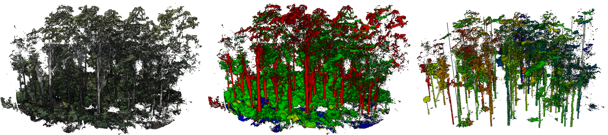
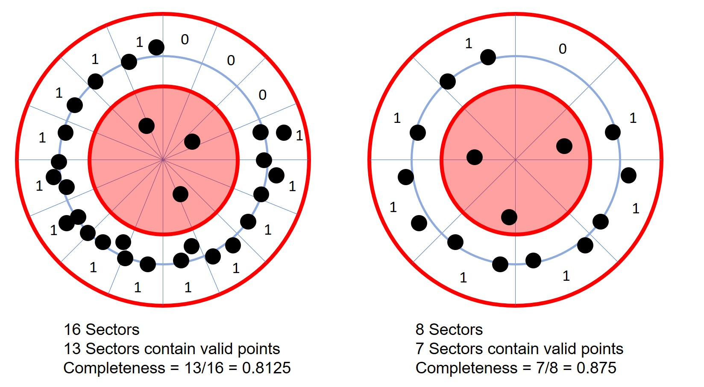
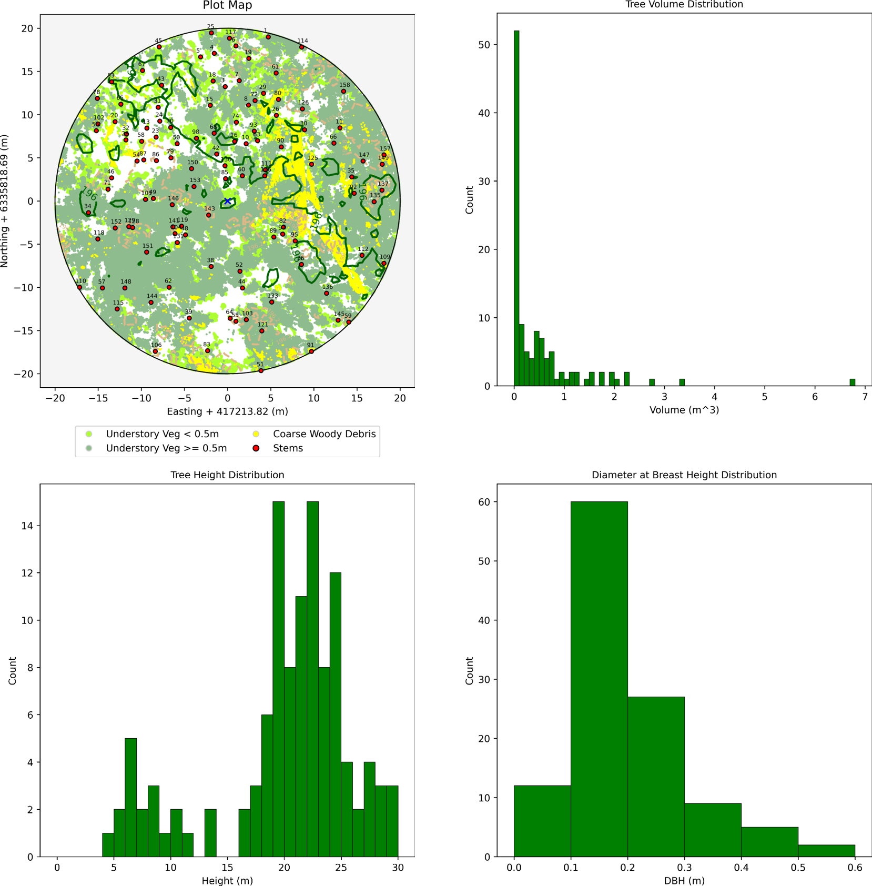
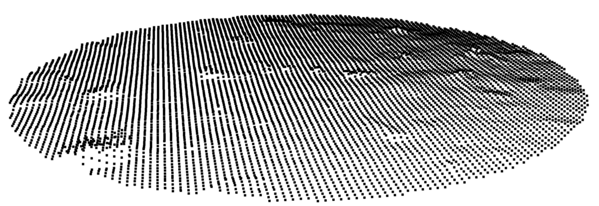
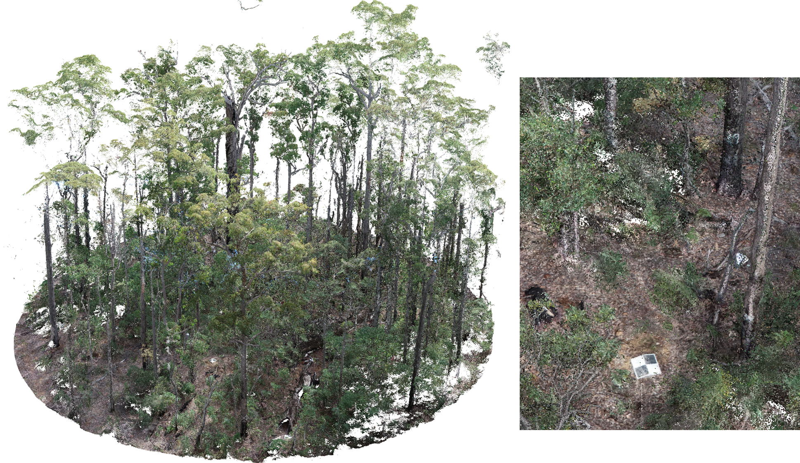
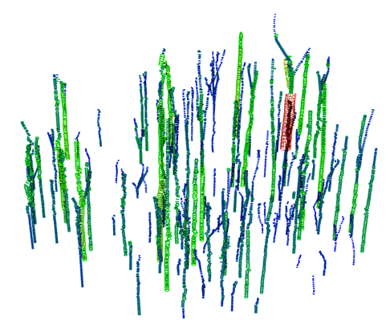
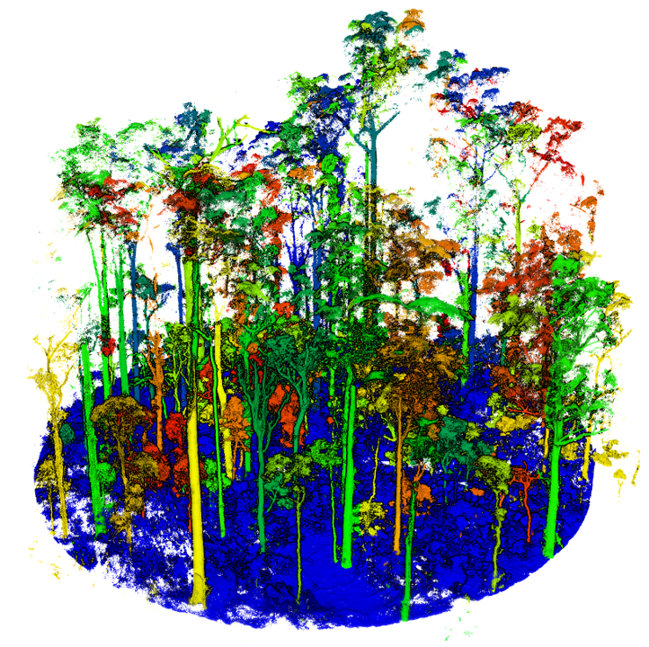
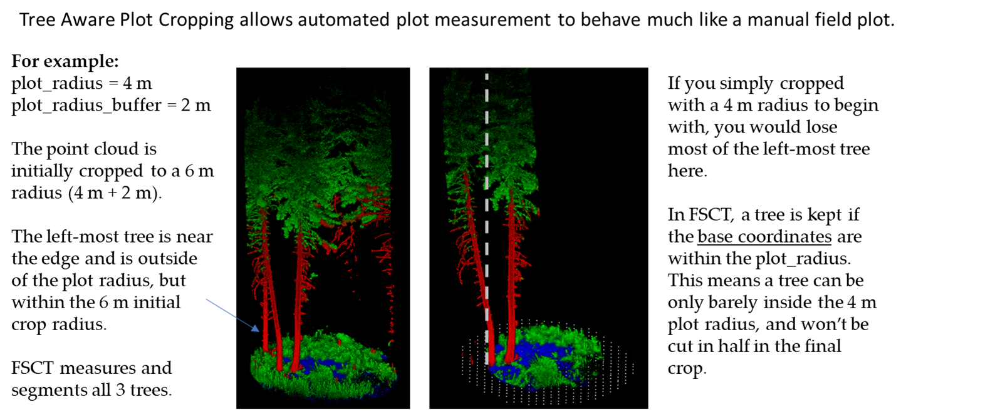

# Forest Structural Complexity Tool

### Created by Sean Krisanski


Automatic plot-scale measurement of forest point clouds. Feed it a `.las` file
and it segments the cloud into terrain, vegetation, coarse woody debris and
stems, builds a terrain model, fits cylinders to the stems and writes out per-tree
measurements: DBH, height, volume, taper and crown position.

**Video of the outputs: https://youtu.be/rej5Bu57AqM**

> **To install and run it, see [USAGE.md](USAGE.md).** What changed between
> releases is in [CHANGELOG.md](CHANGELOG.md). Those are the only other documents
> in this project; everything else is in here.

## What this version adds

This is upstream FSCT — <https://github.com/SKrisanski/FSCT>, by Sean Krisanski
— with two user interfaces, an unattended installer and a substantially faster,
reproducible processing chain wrapped around it. **The segmentation model and
the measurement method are the original work.** Everything in this section is
what differs from that repository.

At a glance:

| | Original FSCT | This version |
|---|---|---|
| How you run it | Edit parameters at the top of `scripts/run.py`, execute it | Desktop app, browser UI, CLI or batch |
| Installation | Assemble the conda environment yourself | `FSCT.bat` does it, asking nothing |
| Repeat runs on one file | Disagree on ~10% of point labels | Deterministic at any CPU core count; exact in fp32, 2 labels in 673,517 with fp16 |
| Circle fit (per slice) | 2737 ms | 28.6 ms — **96x** |
| Cylinder fitting | 1739 ms/cylinder | 29 ms/cylinder — **60x** |
| Preprocessing | 4.04 s | 0.70 s |
| Segmentation | 24.1 s | 17.0 s |
| Current libraries | Crashes on numpy 2.0 / pandas 3.0 / PyG 2.0 | Runs on all three |

Details: [User interfaces](#user-interfaces) · [Installation and
tooling](#installation-and-tooling) · [Reproducibility](#reproducibility) ·
[Performance](#performance) · [Correctness and compatibility
fixes](#correctness-and-compatibility-fixes). Release history is in
[CHANGELOG.md](CHANGELOG.md).

### User interfaces

Upstream has no interface: you edit `scripts/run.py` and run it.

- **Desktop application** (`fsct_desktop.py`, `FSCT.bat gui`) — file picker,
  point-cloud header inspection that reads the header only rather than loading
  every point, parameter controls with hardware-aware defaults, a live
  processing console, a results browser and a plot summary view.
- **Browser UI** (`fsct_web.py`, `FSCT.bat web`) — the same pipeline as a
  Streamlit app, adding an interactive 3D point cloud, height and DBH
  distributions, a stem map and a DBH-height scatter (`visualization_utils.py`).

Both launch from the one `FSCT.bat` and share a single conda environment.

### Installation and tooling

- **One-shot installation.** `FSCT.bat` builds the conda environment, installs a
  matching PyTorch / PyTorch Geometric / torch-cluster triple, installs both
  interfaces and downloads LAStools — without asking anything. Subcommands:
  `gui`, `web`, `setup`, `setup /force`, `verify`, `lastools`, `version`,
  `help`.
- **Unattended batch processing** (`batch_process.py`) — process a directory
  tree from the command line and combine the per-plot summaries into one CSV.
  Upstream's directory mode opens a Tk folder dialog and cannot be scripted.
- **LAStools integration** (`setup_lastools.py`) — downloaded and configured
  automatically, with LAS/LAZ conversion, resampling and an external 3D viewer
  wired into both interfaces.
- **Installation self-test** (`test_installation.py`, `FSCT.bat verify`) —
  checks the Python version, the deep-learning stack, the linear-algebra
  routines, the point-cloud and reporting libraries, the core files, the FSCT
  imports, and optional GPU / LAStools / UI components.
- **Versioning** (`version.py`) — a single source of truth, shown in both
  interfaces, the installation test, `FSCT.bat version` and
  `batch_process.py --version`.

### Correctness and compatibility fixes

Fixed relative to upstream:

- **Runs on current libraries.** `np.percentile(..., interpolation=)` was
  removed in numpy 2.0 and crashed the measurement stage just before tree
  heights were computed. `pandas.read_csv(delim_whitespace=)` was removed in
  pandas 3.0. `DataLoader` moved out of `torch_geometric.data` in PyG 2.0.
- **`get_fsct_path` only worked in a folder named exactly `FSCT`.** It truncated
  `os.getcwd()` at the first "FSCT" substring, so any other folder name resolved
  to a sibling directory that does not exist, and a path with no "FSCT" in it
  raised `ValueError`. It is now derived from the module's own location.

Reproduced on purpose, so measurements stay comparable with published work:

- **Cylinder sorting emits one cylinder short.** The original loop stops with
  the last cylinder still unsorted and never emits it. The rewritten sort keeps
  that behaviour rather than silently changing every plot's cylinder count.
- **CCI sectors are not evenly spaced.** See [Known
  limitations](#known-limitations); `fix_cci_sectors` corrects it, off by
  default.

## Purpose of this tool

This tool was written for the purpose of allowing plot scale measurements to be
extracted automatically from most high-resolution forest point clouds from a
variety of sensor sources. Such sensor types it works on include Terrestrial
Laser Scanning (TLS), Mobile Laser Scanning (MLS), Terrestrial Photogrammetry,
Above and below-canopy UAS Photogrammetry or similar. Very high resolution
Aerial Laser Scanning (ALS) is typically on the borderline of what the
segmentation tool is capable of handling at this time. If a dataset is too low
resolution, the segmentation model will likely label the stems as vegetation
points instead.

There are also some instances where the segmentation model has not seen
appropriate training data for the point cloud. This may be improved in future
versions, as it should be easily fixed with additional training data.

Start with small plots containing at least some trees. The tree measurement code
will currently cause an error if it finds no trees in the point cloud.

## FSCT Outputs

Results land in a folder named `your_file_FSCT_output/`, next to the input file.

### Tabular outputs

`tree_data.csv` — basic measurements of the trees. All units are metres, or
cubic metres for volume. Headings:

```
x_tree_base, y_tree_base, z_tree_base, DBH, CCI_at_BH, Height, Volume_1,
Volume_2, Crown_mean_x, Crown_mean_y, Crown_top_x, Crown_top_y, Crown_top_z,
mean_understory_height_in_5m_radius
```

* CCI_at_BH stands for Circumferential Completeness Index at Breast Height. CCI
  is simply the fraction of a circle with point coverage in a stem slice, as
  illustrated below. This provides an indication of how complete your stem
  coverage is. In a single scan TLS point cloud, you cannot get a CCI greater
  than 0.5 (assuming the cylinder fitting was not erroneous), as only one side
  of the tree is mapped. If you have completely scanned the tree (at the
  measurement location), you should get a CCI of 1.0.

  

  The figure is from https://doi.org/10.3390/rs12101652 if you would like a more
  detailed explanation of the idea.

* Volume_1 is the sum of the volume of the fitted cylinders.
* Volume_2 is the volume of a cone (with a base diameter equal to the DBH and
  height from 1.3 m up to the tree height) + the volume of a cylinder (with a
  diameter of DBH and 1.3 m tall). This avoids the possibility of a short and
  shallow angled cone resulting from a short tree with a large DBH.

`taper_data.csv` — the largest diameter at a range of given heights above the
DTM for each stem, in metres. Headings are PlotId, TreeId, x_base, y_base,
z_base, followed by the measurement heights.

`plot_summary.csv` — summary information about the plot and the processing
times. Be aware: if you open this while processing and FSCT attempts to write to
the open file, it will throw a permission error.

`cleaned_cyls.csv` — every fitted cylinder with its properties.

`Plot_Report.html` and `Plot_Report.md` — a summary of the information
extracted, nicer to look at than the processing report.



### Point cloud outputs

| File | Contents |
|---|---|
| `DTM.las` | Digital Terrain Model in point form |
| `cropped_DTM.las` | DTM cropped to the plot radius |
| `working_point_cloud.las` | Subsampled and cropped cloud fed to the segmentation tool |
| `segmented.las` | Classified point cloud from the segmentation tool |
| `segmented_cleaned.las` | Cleaned segmented cloud from the post-processing step |
| `terrain_points.las` | Semantically segmented terrain points |
| `vegetation_points.las` | Semantically segmented vegetation points |
| `ground_veg.las` | Ground vegetation points |
| `cwd_points.las` | Semantically segmented coarse woody debris points |
| `stem_points.las` | Semantically segmented stem points |
| `cleaned_cyls.las` | Point-based cylinder representation with a variety of properties |
| `cleaned_cyl_vis.las` | Point cloud visualisation of the circles in `cleaned_cyls.las` |
| `stem_points_sorted.las` | Stem points assigned by tree_id |
| `veg_points_sorted.las` | Vegetation assigned by tree_id; ground points get tree_id 0 |
| `text_point_cloud.las` | Point cloud text visualisation of TreeId, DBH, height, CCI at BH and volumes |
| `tree_aware_cropped_point_cloud.las` | Cloud trimmed to plot_radius, if set. See Tree Aware Plot Cropping |

**The two `*_sorted.las` outputs are simple and will not give highly reliable
results.** They may be useful for generating instance segmentation training
datasets, but will likely require manual correction to be good enough for
training data.







## User Parameters

The desktop app and browser UI expose these directly; for the command line they
live in `scripts/run.py`. The `PlotId` is taken from the filename of the input
point cloud, so name files accordingly.

### Set these appropriately for your hardware

`batch_size` — number of samples per batch for deep learning inference. Must be
>= 2. Bigger is **not** faster: see [Performance](#performance).

`num_cpu_cores` — CPU cores to use. 0 means all of them.

`use_CPU_only` — set if you have no Nvidia GPU. Expect inference to take much
longer, and note that CPU also appears to give worse semantic segmentation
results than GPU.

### Circular plot options

`plot_centre` — [X, Y] coordinates of the plot centre in metres. If `None`, the
centre of the bounding box of the point cloud is used.

`plot_radius` — if 0 m, the plot is not cropped. Otherwise the plot is
cylindrically cropped from the plot centre with plot_radius + plot_radius_buffer.

`plot_radius_buffer` — used for Tree Aware Plot Cropping. Leave at 0 if not
using.

#### Tree Aware Plot Cropping

The purpose of this mode is to simulate the behaviour of a typical field plot,
by not chopping trees in half if they are at the boundary of the plot radius.

The point cloud is first trimmed to plot_radius + plot_radius_buffer. For
example, with a 4 m plot_radius and a 2 m plot_radius_buffer, the cloud is
cropped to 6 m initially. FSCT then uses the measurements extracted from the
trees in that 6 m cloud to check which tree centres are within the 4 m radius.
This allows a tree just inside the boundary to extend 2 m beyond it without
losing points. A simple radius trim at 4 m would cut such trees in half.



This mode is used when plot_radius and plot_radius_buffer are both non-zero.

### Optional settings — generally leave as they are

| Parameter | Meaning |
|---|---|
| `slice_thickness` | Thickness of the horizontal stem slices. Raise to 0.2 for lower resolution clouds, drop to 0.1 for very dense ones |
| `slice_increment` | Vertical spacing between slices. Smaller gives better results and a longer run time |
| `height_percentile` | Use 98 rather than 100 if the data has noise above the canopy |
| `ground_veg_cutoff_height` | Vegetation below this height is understory and is not assigned to individual trees |
| `tree_base_cutoff_height` | A tree needs a cylinder below this height above the DTM to be kept. Filters unsorted branches from being called trees |
| `veg_sorting_range` | Max horizontal distance from a cylinder for a vegetation point to be matched to that tree |
| `sort_stems` | Turning this off speeds things up. Veg sorting is required for tree height, but stem sorting is not needed for general use |
| `stem_sorting_range` | Max 3D distance from a cylinder for a stem point to be matched to that tree |
| `taper_measurement_height_min` / `_max` / `_increment` | Range and step of the taper output |
| `taper_slice_thickness` | Cleaned cylinders within ± 0.5 × this are found; the largest radius becomes the diameter at that height |
| `delete_working_directory` | Deletes the segmentation working files when done. Turn off if you want to re-run segmentation without redoing preprocessing |
| `minimise_output_size_mode` | Deletes non-essential outputs to save disk space |

Advanced knobs live in `scripts/other_parameters.py`, including the two that
control cylinder fitting cost (`circle_fit_trials`, `circle_fit_max_points`) and
`fix_cci_sectors`, which corrects a units bug in the CCI sector calculation. It
is off by default because turning it on shifts every downstream number.

## Reproducibility

FSCT runs are deterministic: the same file, seed and batch size give the same
output, and the output does not depend on how many CPU cores are used or how the
work happened to be spread across workers. Four things used to be random:

- boxes with more than `max_points_per_box` points were subsampled with an
  unseeded `random.shuffle`
- the farthest-point-sampling in `scripts/model.py` picks a random starting
  point (`torch_cluster.fps` defaults to `random_start=True`)
- the RANSAC circle fits were unseeded
- worker results were collected in completion order, so the row order of every
  downstream array depended on process scheduling

All are now driven by `random_seed` in `scripts/other_parameters.py` (default
`0`). Set it to `None` for the old non-reproducible behaviour, or to any other
integer to sample differently. The box seed is derived per box id rather than
per thread, and the circle-fit seed per stem cluster, so neither depends on
thread or worker scheduling.

Two caveats:

- Reproducibility holds for the same file, seed **and batch size**. Changing the
  batch size regroups the samples and so changes the order in which the model's
  sampling draws from the seeded random stream. Results stay deterministic, they
  just are not identical to a run at a different batch size.
- With `use_amp=True` (the default) reproduction is very close but not bit-exact:
  fp16 reductions are not deterministic, and two runs measured 2 differing labels
  out of 673,517 (0.0003%). Set `use_amp=False` if you need byte-identical
  output; seeded fp32 runs matched exactly.

## Performance

**FSCT is computationally expensive.** It is still considerably faster than a
human at what it does, and considerably faster than the original.

Every "Original FSCT" figure below is that code path as published in
<https://github.com/SKrisanski/FSCT>, measured on the 673k-point
`data/test/example.las`, RTX 3050 Laptop (4 GB), 16 CPU cores, on an otherwise
idle machine. Absolute wall-clock times move a lot with background load and CPU
clock — the same measurement stage was 19.5 s idle and 44 s with a browser and
an editor running. Every pair was measured back to back under the same
conditions, so the ratios hold even where the absolute numbers do not.

### Where the time goes

| Stage | Original FSCT | This version |
|---|---|---|
| Preprocessing | 4.04 s | 0.70 s |
| Segmentation | 24.1 s | 17.0 s |
| Post-processing | — | 1.6 s |
| Measurement | see below | 19.5 s |

For a whole-run reference point, the full pipeline on the 673k-point
`data/test/example_clean.las` — preprocessing, segmentation, post-processing,
measurement and report — completes in **88 s** at 16 cores, batch 4, with
`use_amp` on.

### Measurement stage

The measurement stage was dominated by circle fitting. `skimage.measure.ransac`
was called with `min_samples` set to 30% of the slice and `max_trials=10000`.
That combination is one for which RANSAC's early-stopping rule almost never
fires, so nearly every circle ran the full 10,000 trials, each one a Python-level
`np.linalg.lstsq` plus a residual pass over every point in the slice.

| Measurement | Original FSCT | This version | |
|---|---|---|---|
| One circle fit (60 real stem slices) | 2737 ms | 28.6 ms | **96x** |
| Cylinder fitting, all clusters, single process | 1739 ms/cylinder | 29 ms/cylinder | **60x** |
| Whole measurement stage, 16 cores | — | 19.5 s | |

What changed in the measurement stage:

- **The circle RANSAC is batched.** Trials are sampled, fitted and scored with
  array operations instead of one Python loop iteration each, and the same
  dynamic stopping rule is applied after every batch. Same model, same scoring,
  same stopping criterion. Agreement with skimage was checked on 60 real stem
  slices: median radius difference 1.5 mm and 95th percentile 33 mm, against
  35 mm of disagreement between two independent skimage runs on the same slices.
  `circle_fit_trials` and `circle_fit_max_points` in `other_parameters.py`
  control the trial count and the point cap.
- **Plane slicing is indexed, not scanned.** Selecting the points near each
  circle's plane scanned the whole stem cluster once per skeleton position. It
  now binary-searches a pre-sorted coordinate first, and returns an identical
  slice.
- **Cylinder sorting and cleaning are no longer quadratic.** Both rebuilt a
  spatial index and copied the whole array on every iteration. One index plus an
  active mask gives the same processing order and the same neighbourhoods.
- **Cylinder visualisation is vectorised.** It used to dispatch one pool task per
  cylinder to produce 15 points; the two visualisation passes were 21 s of a
  55 s stage, and are now under a second.
- **Slice clustering runs in parallel**, and cutting the slices binary-searches
  a sorted height instead of boolean-scanning the whole stem cloud per slice.
- **One worker pool** is shared by every parallel stage. Spawning a pool on
  Windows re-imports numpy, scipy, sklearn and hdbscan in each worker; that was
  being paid three times per run.
- **`np.percentile(..., interpolation=)`** was removed in numpy 2.0. The
  measurement stage crashed on it, just before tree heights were computed.

Earlier work on the front half of the pipeline:

- **Box extraction** was O(boxes × points) — it boolean-scanned the entire cloud
  once per box. Now one shared `cKDTree`, queried with a Chebyshev (p=inf) ball,
  which is exactly an axis-aligned cube. `cKDTree` releases the GIL, so the
  worker threads now genuinely run in parallel.
- **Segmentation output assembly** called `.cpu()` seven times per iteration,
  four of them inside a per-sample inner loop; each is a blocking device sync.
  Now one transfer per batch. Verified: 0 label differences across 1.6M points.
- **`choose_most_confident_label`** ran its kNN query single-threaded and built
  an `(N, 16, 7)` temporary — about 600 MB at 700k points — to read 4 columns.
- **Mixed precision** (`use_amp`), which on a small GPU matters as much for
  memory as for arithmetic.
- **DTM construction** grew its array with `np.vstack` inside a nested loop,
  making it quadratic in grid cells (40,000 cells for a 100 × 100 m plot at
  0.5 m resolution).

### Batch size: bigger is not faster

Segmentation memory scales with the batch, and overflowing VRAM is much worse
than a small batch. In fp32 on a 4 GB card:

| batch | time | peak VRAM |
|---|---|---|
| 2 | 17.0 s | 1.37 GB |
| 4 | 25.3 s | 2.42 GB |
| 6 | 54.2 s | 3.28 GB |

Past roughly 2.5 GB the driver starts paging activations to host memory and
throughput collapses. Mixed precision roughly halves the requirement, so
`batch=4` with `use_amp=True` measured 8.4 s for the same work. The desktop app
picks a default batch size from the detected VRAM and says so under the slider.
Raising it beyond that is usually a pessimisation.

### Recommended PC specifications

A CUDA-compatible Nvidia GPU is **strongly recommended**. Most modern gaming
desktops or decently powerful laptops will do. The original author's setup:

- CPU: Intel i9-10900K
- GPU: Nvidia Titan RTX (24 GB vRAM)
- RAM: 128 GB DDR4 (if you run out of RAM, try increasing your page file size on
  Windows or swap size on Linux)

## Scripts

### Scripts you would normally interact with

| Script | Purpose |
|---|---|
| `fsct_desktop.py` | Desktop application. Launch with `FSCT.bat gui` |
| `fsct_web.py` | Browser UI. Launch with `FSCT.bat web` |
| `scripts/run.py` | Command-line entry point; edit the parameters at the top |
| `batch_process.py` | Process a whole directory of point clouds unattended |
| `scripts/combine_multiple_output_CSVs.py` | Combines all `plot_summary.csv` files into one CSV, saved in the highest common directory of the selected clouds |
| `scripts/run_with_multiple_plot_centres.py` | Enter plot coordinates for each of several clouds |
| `test_installation.py` | Installation checks. Run with `FSCT.bat verify` |

### Scripts you would only use directly if modifying the software

| Script | Purpose |
|---|---|
| `scripts/run_tools.py` | Helper functions that clean up `run.py` |
| `scripts/tools.py` | Other helper functions used throughout the code base |
| `scripts/preprocessing.py` | Subsamples the input cloud and slices it into samples the segmentation model can work with |
| `scripts/model.py` | The segmentation model, modified from the PyTorch Geometric implementation of PointNet++ |
| `scripts/inference.py` | Runs semantic segmentation on the samples and reassembles them into a full cloud |
| `scripts/post_segmentation_script.py` | Creates the DTM, cleans the segmented cloud and writes the class-specific clouds |
| `scripts/measure.py` | Extracts measurements and metrics from the post-segmentation outputs |
| `scripts/report_writer.py` | Summarises the measurements in a simple report format |
| `scripts/other_parameters.py` | Advanced parameters |
| `visualization_utils.py` | Plot helpers for the browser UI |
| `setup_lastools.py` | Downloads and configures LAStools |
| `make_icon.py` | Redraws the application icon (`icon.ico`, `icon.png`). Only needed if the artwork changes |

## Known limitations

* Young trees with a lot of branching do not currently get segmented correctly.
* Some extremely large trees do not currently get measured properly as the rules
  don't always hold.
* FSCT is unlikely to output useful results on low resolution point clouds.
  *Very high* resolution aerial LiDAR is about the lowest it can currently cope
  with. If your dataset is on the borderline, try setting
  `low_resolution_point_cloud_hack_mode` in `other_parameters.py` to 4 or 5 and
  rerunning. It's an ugly hack, but it can help sometimes.
* Segmentation does often miss some branches, but usually gets the bulk of them.
* Small branches are often not detected.
* Completely horizontal branches/sections may not be measured correctly from the
  method used.
* The CCI sector angles are built in degrees but consumed as radians, so the 80
  "evenly spaced sectors" are really 80 arbitrary directions. They land
  quasi-uniformly around the circle, so CCI still roughly tracks circumferential
  coverage, but the values are not what the method describes. `fix_cci_sectors`
  corrects it; it is off by default because CCI decides which cylinders survive,
  so stem count, DBH and tree height all move with it.

## Training a new semantic segmentation model

FSCT relies heavily on the segmentation model working properly. Training your own
model may help expand the utility of FSCT to datasets outside the original
training set.

### Step 1 — Creating training data

Unless you modify the code, training data must be provided as a `.las` file with
a `label` column, with integer labels as follows: 1 Terrain, 2 Vegetation,
3 Coarse woody debris, 4 Stems/branches.

Look at a `segmented.las` or `segmented_cleaned.las` file as an example of what
the training data must look like. It is strongly recommended to use FSCT to label
your data, **then** correct it manually.

**Note: manually segmenting/correcting point clouds is extremely tedious.** The
original dataset took the author 3-4 weeks to label from scratch. CloudCompare's
segmentation tool works well for manual correction; start by loading
`terrain_points.las`, `vegetation_points.las`, `cwd_points.las` and
`stem_points.las`. Take great care to label consistently — sloppy labelling may
result in your model not learning what you want it to learn.

### Step 2 — Preparing training data

Chop your chosen point cloud into train, validation and test slices — 50%, 25%
and 25% is a reasonable split, but use your discretion. Save each slice as a
`.las` file and place them in `data/train/`, `data/validation/` and `data/test/`.

You can have multiple point clouds in those directories; during preprocessing
they are all placed in the respective `sample_dir` directories.

### Step 3 — Preprocessing the training data

Set `preprocess_train_datasets`, `preprocess_validation_datasets` and
`preprocess_test_datasets` to True and run `scripts/train.py`. After the first
run, set them back to False to avoid duplicating samples in `sample_dir`.

**Preprocessing adds files to `sample_dir` but does not delete them.** So when
adding a new training cloud you have two options:

- **Option A** — move the already-processed clouds out of `data/train/`, add the
  new one, run preprocessing, then move them back. Only the new cloud is
  processed.
- **Option B** — leave everything in place, manually delete the contents of
  `sample_dir`, and re-run preprocessing for everything.

Both achieve the same thing; A is more efficient, B is necessary if you want to
*remove* a sample cloud from the dataset.

### Step 4 — Train the model

Set the parameters according to your hardware. If you have CUDA errors, reduce
the batch size or switch to CPU mode. `scripts/training_monitor.py` plots the
loss and accuracy; run it in a separate terminal alongside the training script.

**The training process will take several days on a powerful desktop computer.**

### Step 5 — Use the trained model

Change `model_filename` in `scripts/other_parameters.py` to the model you named
in `train.py`.

### An idea potentially worth exploring

FSCT is already capable of producing reasonably well segmented point clouds
(within the stated limitations). By leveraging FSCT to automatically segment
point clouds, it seems likely that the model could almost train itself into a
more consistent and robust state through the use of carefully designed data
augmentations.

## Citation

If you wish to cite this work, please use the citation below. If citing for
something other than a scientific journal, feel free to link to the GitHub
instead.

> Krisanski, S.; Taskhiri, M.S.; Gonzalez Aracil, S.; Herries, D.; Muneri, A.;
> Gurung, M.B.; Montgomery, J.; Turner, P. Forest Structural Complexity Tool—An
> Open Source, Fully-Automated Tool for Measuring Forest Point Clouds. Remote
> Sens. 2021, 13, 4677. https://doi.org/10.3390/rs13224677

## Use of this code

Please feel free to use/modify/share this code. If you can improve/evaluate the
code somehow and wish to make a paper of it, please do. Commercial use of FSCT is
also permitted. Sharing your improvements would be great, but you are not
obligated.

Upstream project: https://github.com/SKrisanski/FSCT

## Acknowledgements

This research was funded by the Australian Research Council — Training Centre for
Forest Value (IC150100004), University of Tasmania, Australia.

Thanks to the supervisory team, Assoc. Prof Paul Turner and Dr. Mohammad Sadegh
Taskhiri from the eLogistics Research Group and Dr. James Montgomery from the
University of Tasmania.

Thanks to Susana Gonzalez Aracil and David Herries from Interpine Group Ltd
(New Zealand) https://interpine.nz/, and Allie Muneri and Mohan Gurung from
PF Olsen (Australia) Ltd. https://au.pfolsen.com/, who provided a number of the
raw point clouds and plot measurements used during the development and validation
of this tool.

## References

The deep learning component uses PyTorch https://pytorch.org/ and PyTorch
Geometric https://pytorch-geometric.readthedocs.io/

The first step is semantic segmentation of the forest point cloud, performed
using a modified version of PointNet++ https://github.com/charlesq34/pointnet2,
starting from the PyTorch Geometric implementation
https://github.com/pyg-team/pytorch_geometric/blob/master/examples/pointnet2_segmentation.py
